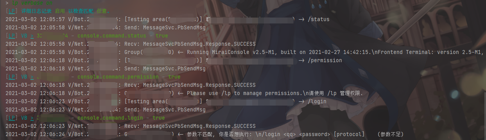
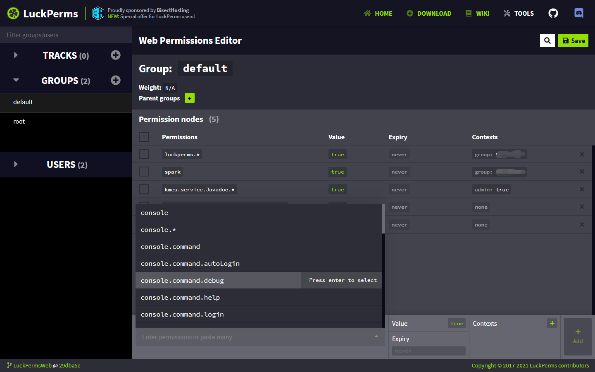
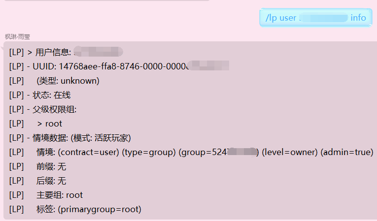
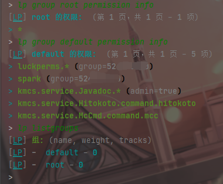

# LuckPerms Mirai

LuckPerms, 经典的权限系统, 已经接入Mirai-Console Permission Service.

View Plugin Site: https://mirai.mamoe.net/topic/68/

----

# Snapshot






---

# Usages

> LuckPerms-Mirai 基于 LuckPerms 开发, 详细用法请百度/谷歌/阅读 LuckPerms wiki

> [LuckPerms wiki](https://luckperms.net/wiki)

LuckPerms-Mirai 的身份上下文使用 context 实现, 可以在聊天中使用
`/lp user <****> info` 查看上下文

下面是一些示例命令

```kotlin

// 授予群聊管理员(包含群主)一项权限
/lp group default permission add AdminPermission admin=true

// 授予群主一条权限
/lp group default permission add OwnerPermission level=owner

// 授予管理员(不含群主)一条权限
/lp group default permission add OwnerPermission level=admin

// 授予在某个群的所有人一条权限
/lp group default permission add PermissionInGroup group=1234567890

// 授予某个群的群聊管理员一条权限
/lp group default permission add PermissionInGroup group=1234567890 admin=true


// 创建系统管理组
/lp creategroup root
/lp group root permission add *
/lp user 1234567890 parent set root

// 开启权限调试模式 (debug(verbose) mode)
// WARNING: Dont run this command in chatting
/lp verbose on

// 开启权限调试模式 (debug(verbose) mode), 并在 Web 查看
/lp verbose record
//WAIT.....
/lp verbose upload

```

----

## 实现细节

对于 Mirai-Console Permission System. Permission有以下内容
- Permission本身
- Permission的父Permission

对于 Mirai-Console Built-In PermissionSystem. 他会有以下行为

- 如果可以拥有权限的对象(`Permittee`) 拥有
 `Permission` 或者 `Permission的任何一级parent`,
  那么代表此 `Permittee` 拥有这个权限

---

对于 LuckPerms-Mirai, 会有以下行为
- 获取当前权限节点状态
- 如果权限节点是已设置的, 返回该权限节点的状态
- 如果当前节点已经是 Root 权限节点, 中断, 判断为没有权限
- 重新检查该权限节点的parent
- 特别的, `Console` 拥有全部权限

LuckPerms 采用拦截式的权限判断.
- 设: 当前需要判断的权限对象拥有的权限为 `*=true`, `deny=false`
- 那么该对象拥有**除了** `deny` 之外的全部权限

# Dev

## 特别权限节点
LuckPerms Mirai 提供了一些特别的权限节点(权限ID), `namespace:id` 在对应代码中为 `PermissionId(namespace, id)`
- 对于 `*:*`, LuckPerms-Mirai会直接识别成 `*`, 代表 ROOT
- 对于 `<lp>:%`, LuckPerms-Mirai 会直接返回true, 代表没有权限检查
  - `<lp>.<void>` 与 `<lp>.%` 拥有相同效果
- 对于 `namespace:`(`PermissionId(namespace, "")`),
  LuckPerms-Mirai 会识别成 `namespace` 而不是 `namespace.`
- PermissionService#register
    - 对于 parentId为 `<lp>:#` 的权限,
      LuckPerms-Mirai 将直接提供权限节点并不进行任何注册检查,
      父权限指定

## 如何使用
- 正常接入Mirai-Console Permission System即可

